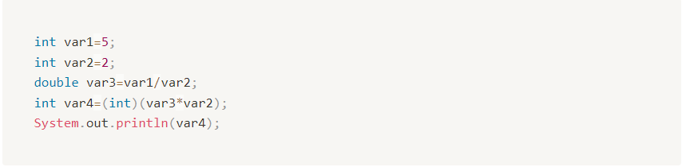
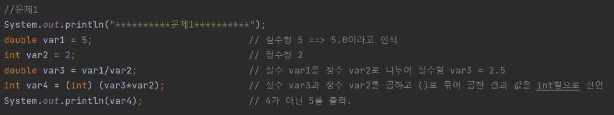
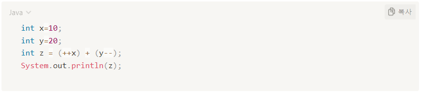
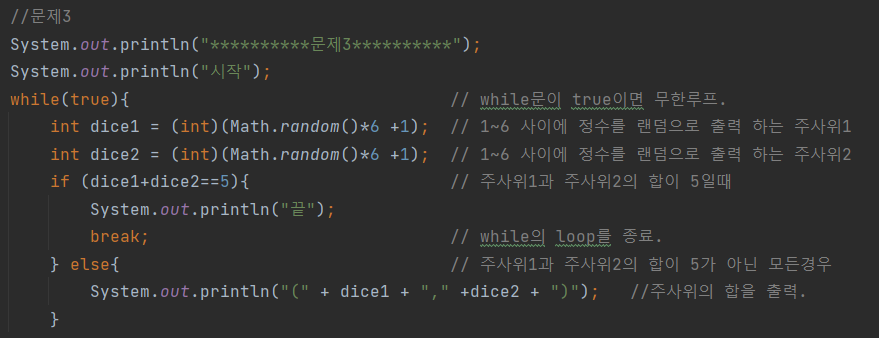
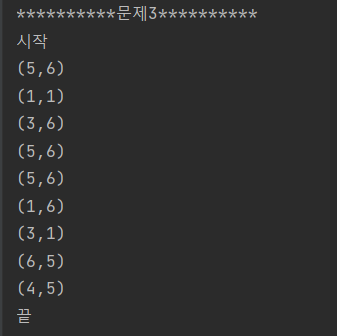

# Java-Assignment
문제1) 다음 코드를 실행하면 출력 결과로 5를 기대했는데 4가 출력되었습니다. 어디에서 잘못 작성된 것일까요?

해설)
>우선 기본적으로 변수에는 타입을 지정해주어야 합니다.

>정수인 var1을 정수인 var2로 나누면 우리가 아는 값은 2.5여도 자바에서는 정수var1/정수var2는 정수로 값을 반환해줍니다.

> 때문에 var3는 실수형으로 지정해도 var1/var2이곳에서 반환된 4를 var3에 저장합니다.

>따라서 나누기를 할때 몫이 실수로 나오려면 나눔의 대상이된 var1도 실수형이 되어야 합니다.

>그리하면 결과적으로 var1의 타입을 double(실수)형으로 바꿔주면 기댓값 5가 정상 출력됩니다.

코드)
>

출력)
> 

------------------------------------------------------------------------
문제2) 다음 코드를 실행했을 때 출력 결과는 무엇입니까? (증감연산자에 대해 알아보세요!)

해설)
>증감연산자는 두 경우로 분리하여 볼수 있을거 같습니다.
> 1. 선 연산 후 대입.
> 2. 선 대입 후 연산.

선 연산 후 대입
>++i or --i  ==> 선 더하기 or 빼기 || 후 대입

선 대입 후 연산
>i++ or i--  ==> 선 대입 || 후 더하기 or 빼기

이러한 증감연산자의 특성 때문에 z는 x(11) + y(20)의 값인 31이 나오게 됩니다.

출력)
>

------------------------------------------------------------------------
문제3) while문과 Math.random() 메소드를 이용해서 2개의 주사위를 던졌을 때 나오는 눈을 (눈1, 눈2) 형태로 출력하고, 눈의 합이 5가 아니면 계속 주사위를 던지고, 눈의 합이 5이면 실행을 멈추는 코드를 작성해보세요. 눈의 합이 5가 되는 조합은 (1,4), (4,1), (2,3), (3,2)입니다.

해설)
> random()메소드는 반환형이 double(실수)형 입니다.
> 즉 Math.random()을 사용하면 랜덤으로 0~1사이에 있는 실수를 반환하기 때문에,
> 우리가 난수를 정수형으로 받고 싶다면, 앞에 정수(int)형 타입을 적어줘야 합니다.

예시) 1~10까지의 범위를 지정하고싶다.
>(int) (Math.random()*10 +1);

위와 같이 작성을 해주시면 됩니다.
>(int) (Math.random()*최대값 +증감값);  이라고 보시면 될 것 같습니다.

따라서 위의 이야기들을 종합하여 문제3이 요구하는 코드는 아래와 같이 작성하였습니다.

코드)
>

출력)
>

## 문제해결 코드는 Main.java파일에 있습니다.!:)